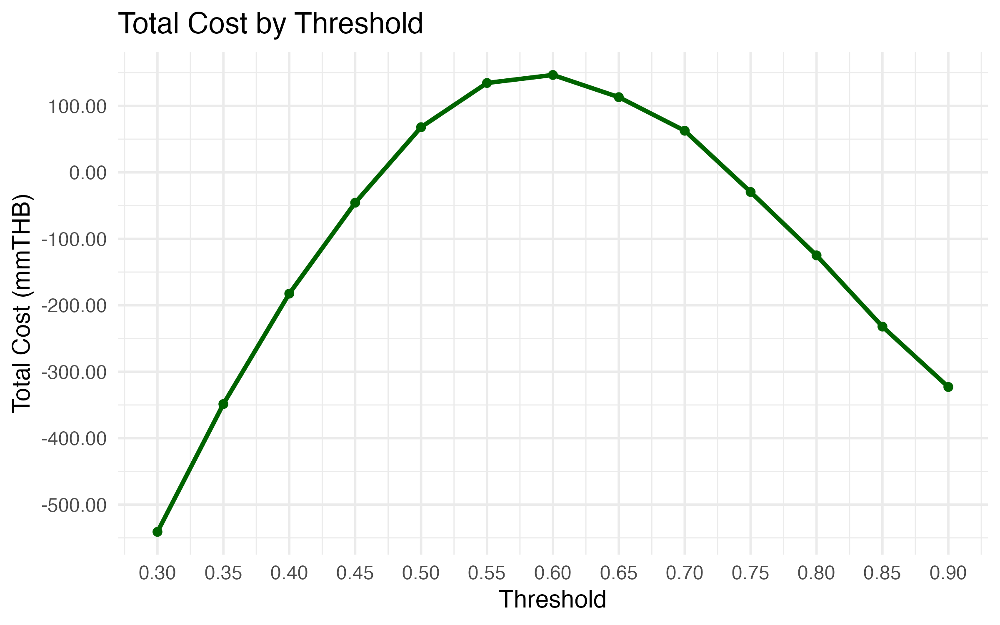
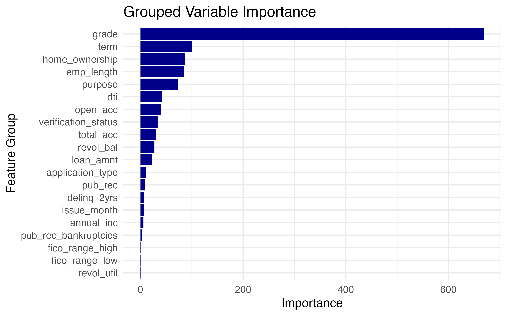
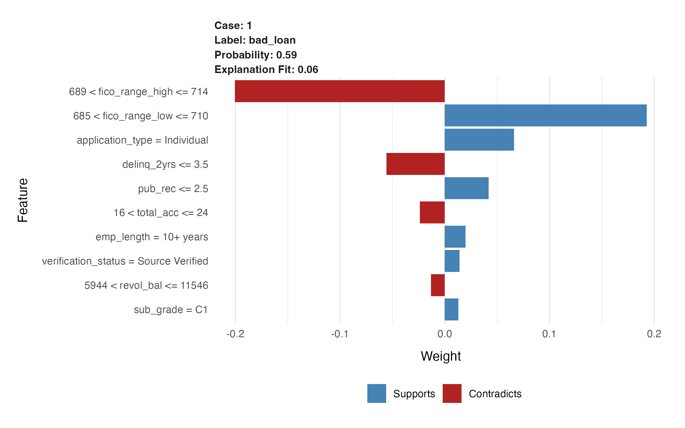

# Loan Default Prediction with Logistic Regression and Cost-Based Threshold Tuning

This project builds a loan approval model from LendingClub loan data, focusing not just on classification accuracy but on **business-driven optimization**. Instead of optimizing for accuracy or AUC alone, we optimize for **financial profit** by tuning the decision threshold based on expected costs of false approvals and rejections.

---

## Objective

> Predict whether a loan application should be approved or rejected using only pre-approval data, while minimizing business losses and maximizing profit.

---

## Dataset

- **Source**: LendingClub public dataset (2007–2018)  
- **Sample**: 200,000 rows  
- **Target**: `loan_status` (good_loan vs bad_loan)  
- **Scope**: Only features available before loan approval are used for modeling.

### Features Used (Pre-approval Only)

| Feature           | Description                                                                 |
|------------------|-----------------------------------------------------------------------------|
| `loan_amnt`       | Requested loan amount (in USD)                                              |
| `term`            | Loan repayment term (e.g. 36 months or 60 months)                           |
| `grade`           | LendingClub-assigned credit grade (A–G)                                     |
| `sub_grade`       | More granular credit score within grade (e.g. A1, B2)                       |
| `emp_length`      | Applicant's length of employment (e.g. "<1 year", "10+ years")              |
| `home_ownership`  | Home ownership status (e.g. RENT, OWN, MORTGAGE)                            |
| `annual_inc`      | Annual income declared by borrower                                          |
| `purpose`         | Stated purpose for the loan (e.g. debt_consolidation, credit_card)          |
| `dti`             | Debt-to-income ratio (lower is better)                                      |
| `delinq_2yrs`     | Number of past delinquencies in last 2 years                                |
| `inq_last_6mths`  | Number of credit inquiries in the last 6 months                             |
| `open_acc`        | Number of open credit lines                                                 |
| `revol_util`      | Revolving credit utilization (% used of total available credit)             |
| `fico_range_low`  | Lower bound of borrower's FICO score range                                  |
| `fico_range_high` | Upper bound of borrower's FICO score range                                  |

**Note:**  
The raw file `accepted_2007_to_2018Q4.csv` is not included in this repository due to file size limitations (>100MB).  
You can download it manually from LendingClub:  
[https://www.lendingclub.com/info/download-data.action](https://www.lendingclub.com/info/download-data.action)

---

## Data Cleaning Process

This section outlines how raw LendingClub data was processed into a usable form for modeling:

### 1. Sampling and NA Filtering

- Loaded 1,000,000 rows from `accepted_2007_to_2018Q4.csv`
- Randomly sampled 200,000 rows to reduce computation
- Dropped columns that contain **only NA values**

### 2. Feature Selection

Selected relevant pre-approval features based on domain knowledge:

- **Loan details**: `loan_amnt`, `term`, `grade`, `sub_grade`
- **Borrower info**: `emp_length`, `home_ownership`, `annual_inc`, `verification_status`
- **Loan purpose**: `purpose`, `application_type`
- **Credit history**: `dti`, `revol_util`, `revol_bal`, `delinq_2yrs`, `open_acc`, `total_acc`, `pub_rec`, `pub_rec_bankruptcies`, `fico_range_low`, `fico_range_high`
- Extracted `issue_month` from `issue_d` (dropped original date field)

### 3. Target Label Creation

- `loan_status` was recoded into:
  - `good_loan` = Fully Paid
  - `bad_loan` = Charged Off / Default
- All other statuses were excluded

### 4. Type Conversion

- Converted relevant variables to `factor` type (e.g., `term`, `grade`, `emp_length`)
- Parsed issue date into `issue_month`

### 5. Train-Test Split

- Used custom function `split_data()` to divide data into training and testing sets (80:20)

### 6. Missing Value Imputation

- Saved median values of `dti` and `revol_util` for consistent imputation
- `emp_length`: created "unknown" category for missing values
- Applied median imputation for numeric features

### 7. Saved Outputs

Saved the following files for use in later scripts:
- `data/train.rds`
- `data/test.rds`
- `data/loan_data.rds`
- `data/dti_median.rds`
- `data/revol_median.rds`

---

## Modeling Approach

### Models Trained

| Model               | Accuracy | Sensitivity | Specificity | Precision | AUC    |
|--------------------|----------|-------------|-------------|-----------|--------|
| Logistic Regression| 0.6552   | 0.6514      | **0.6696**  | **0.8807**| 0.7218 |
| XGBoost            | **0.7935**| **0.9704** | 0.1310      | 0.8070    | 0.7187 |

---

### Why Logistic Regression?

Despite XGBoost having higher **accuracy**, **Logistic Regression was selected** because:

- It yields much higher **specificity** (0.6696 vs 0.1310), meaning it **approves fewer bad loans**
- It is **interpretable** — ideal for regulated financial environments
- For approval models, **avoiding false approvals (bad_loan)** is more critical than catching every good loan

---

## Business Cost Function

To simulate real-world profit/loss:

- Approving a good loan (TP: True Positive): **+15% return**
- Approving a bad loan (FP: False Positive): **−85% loss**
- Rejecting a good loan (FN: False Negative): **−3% opportunity cost (lost potential return)**

### Total Cost Formula

```
Total_Cost = (TP * 15%) - (FP * 85%) - (FN * 3%)
```

To convert into monetary value, we assume:  
**Average loan amount = 518,177 THB** (calculated from dataset)

---

## Cost-Based Threshold Tuning (GLM only)

| Threshold | TP    | FP   | FN    | TN   | Sensitivity | Specificity | Total Profit (Million THB) |
|-----------|-------|------|-------|------|-------------|-------------|-----------------------------|
| 0.30      | 24426 | 4954 | 2596  | 2261 | 0.9039      | 0.3134      | -540.96                     |
| 0.35      | 23084 | 4299 | 3938  | 2916 | 0.8543      | 0.4042      | -348.61                     |
| 0.40      | 21545 | 3660 | 5477  | 3555 | 0.7973      | 0.4927      | -182.45                     |
| 0.45      | 19687 | 3020 | 7335  | 4195 | 0.7286      | 0.5814      | -45.64                      |
| 0.50      | 17602 | 2384 | 9420  | 4831 | 0.6514      | 0.6696      | +68.01                      |
| **0.60**  | 12999 | 1335 | 14023 | 5880 | 0.4811      | **0.8150**  | **+146.60**                 |
| 0.65      | 10613 | 944  | 16409 | 6271 | 0.3928      | 0.8692      | +113.22                     |
| 0.70      | 8324  | 607  | 18698 | 6608 | 0.3080      | 0.9159      | +62.70                      |
| 0.75      | 6155  | 379  | 20867 | 6836 | 0.2278      | 0.9475      | -29.49                      |
| 0.80      | 4211  | 201  | 22811 | 7014 | 0.1558      | 0.9721      | -124.90                     |

**Optimal threshold = 0.60**, maximizing expected business profit by **+146.60 million THB** (on test set)

### Total Cost by Threshold

This plot shows the trade-off between false approvals and false rejections as we change the threshold.  
Profit peaks at threshold = 0.60.



---

## Final Model Performance (Threshold = 0.60)

| Metric              | Value   |
|---------------------|---------|
| Accuracy            | 0.5514  |
| Sensitivity (TPR)   | 0.4811  |
| Specificity (TNR)   | **0.8150**  |
| Precision (PPV)     | 0.9069  |
| AUC                 | 0.7218  |
| Business Profit     | **+146.60 million THB** |

This result reflects a **conservative approval strategy**, favoring **rejecting questionable applicants** over mistakenly approving default risks.

### Grouped Feature Importance (Logistic Regression)

This chart visualizes which variables were most influential in the final logistic model.  
`Grade` dominates the influence, followed by `term`, `home_ownership`, and `employment length`.



### Model Interpretability (LIME)

To ensure model transparency and regulatory alignment, we applied **LIME (Local Interpretable Model-agnostic Explanations)** on our Logistic Regression model.

LIME helps explain *individual predictions*, especially for borderline cases near the decision threshold.

### Case Example: Rejected Applicant  
**Prediction**: `bad_loan`  
**Probability**: 0.59  
**Explanation Fit**: 0.06

| Feature                          | Value / Bin                  | Contribution to Prediction (`bad_loan`) |
|----------------------------------|------------------------------|------------------------------------------|
| `fico_range_high` (689–714)     | Moderate credit score        | Strongly supports rejection (−0.20)    |
| `fico_range_low` (685–710)      | Moderate credit score        | Pulls toward approval (+0.21)         |
| `application_type = Individual` | Single applicant             | Supports approval (+0.08)             |
| `delinq_2yrs ≤ 3.5`             | Few delinquencies            | Supports rejection (−0.07)            |
| `pub_rec ≤ 2.5`                 | Low public record count      | Supports approval (+0.06)             |
| `total_acc = 16–24`             | Moderate account count       | Supports rejection (−0.05)            |
| `emp_length = 10+ years`        | Long employment              | Slightly supports approval (+0.03)    |
| `revol_bal = 5,944–11,546`      | Medium revolving balance     | Minor rejection signal (−0.01)        |
| `verification_status = Verified`| Income source verified       | Slightly supports approval (+0.02)    |
| `sub_grade = C1`                | Mid-tier sub-grade           | Weak rejection signal (−0.01)         |

This borderline case had mixed signals: strong credit score issues pushed it toward rejection, while stable income and employment helped a bit.  
Such **interpretable explanations** are essential for model **transparency**, **auditability**, and potential **manual overrides**.



---

## Business Impact of Misclassifications

We translated classification errors into **business risks** to better align the model with stakeholder goals:

| Type                | Business Consequence                                      |
|---------------------|-----------------------------------------------------------|
| False Positive (FP) | Approving bad loans → **Direct capital loss**            |
| False Negative (FN) | Rejecting good loans → **Lost profit / opportunity cost**|

In high-volume lending, even a small lift in **specificity** can **save millions** in defaults.  
Therefore, the model prioritizes **avoiding false approvals** over maximizing coverage.

We also recommend flagging borderline cases (e.g. 0.55 < probability < 0.65) for **manual review**.
  
---

## Project Structure

```
CostBasedLoanApproval/
├── data/
│   ├── best_threshold.rds
│   ├── cost_results.rds
│   ├── dti_median.rds
│   ├── imp_grouped_glm.rds
│   ├── loan_data.rds
│   ├── revol_median.rds
│   ├── test.rds
│   └── train.rds
├── models/
│   ├── model_glm.rds (not included on GitHub, large file)
│   └── model_xgb.rds
├── outputs/
│   ├── plot_grouped_varimp.png
│   └── plot_threshold_cost.png
├── R/
│   ├── 01_data_cleaning.R
│   ├── 02_functions.R
│   ├── 03_model_training.R
│   ├── 04_threshold_tuning.R
│   └── 05_visualization.R
├── run_all.R
├── README.md
└── README_model_glm.txt
```

**Large file exclusion**:  
- `accepted_2007_to_2018Q4.csv` is excluded due to GitHub file size limit  
- Trained models `model_xgb.rds` excluded from repo  
- See `README_model_glm.txt` for instructions to generate your own

---

## Key Learnings

> ❝ Every prediction is a financial bet. We optimized for expected monetary gain, not just model score. ❞

- **Business understanding is crucial**: Translating misclassifications into monetary costs led to better decision-making than optimizing for AUC alone.
- **Model interpretability matters**: Logistic Regression’s transparency is invaluable in real-world, regulated settings.
- **Sensitivity vs Specificity trade-off**: A high sensitivity (XGBoost) may approve too many risky loans. Logistic Regression provides a better balance.
- **Threshold tuning beats model switching**: A tuned simple model can outperform a complex model in terms of **business value**.
- **Business alignment**: This approach aligns with:
  - **CFO and credit risk officer KPIs**
  - **Real-world P&L considerations**

---

✉️ Created by Title Jearrajinda — 2025  
For questions, feel free to open an issue or reach out.
